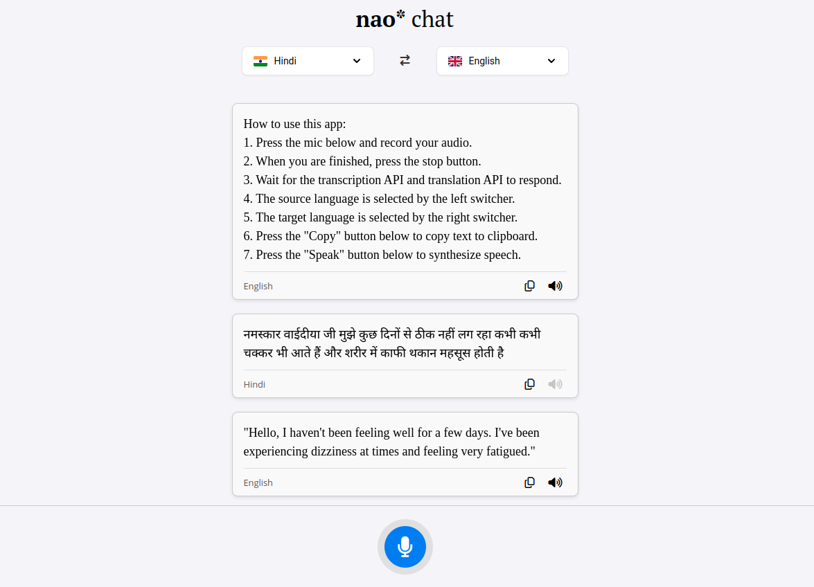

# Nao\* Chat

Nao\* chat is a multilingual translation app that allows the user to provide spoken input and hear an audio playback of the translated message.

<div>

</div>

## Installation

Clone this GitHub repository:

```bash
git clone https://github.com/yahyavaleo/nao-chat
```

> If you do not have Git installed, you can download this project as a zip file. Above the list of files, click **Code**, then click **Download ZIP**.

Run the following command to start a basic web server, and visit `http://127.0.0.1:8000/` on your browser to view the live web app.

```python
python3 -m http.server 8000 --bind localhost
```

> Make sure you have Python installed on your machine. If you do not have Python installed, visit the [Python website](https://www.python.org/downloads/) for instructions on how to install Python on your machine.

> If `python3` is not recognized as a command, try replacing it with `python`.

Alternatively, you can use [Live Server](https://marketplace.visualstudio.com/items?itemName=ritwickdey.LiveServer) to launch the web app.

## User Guide

To use the web app, follow these instructions:

1. Press the mic at the page footer and record your audio.
2. When you are finished, press the stop button.
3. Wait for the transcription API and translation API to respond (this can take a little time depending on how long your message is).
4. You can change the source language from the language switcher on the left.
5. You can change the target language from the language switcher on the right.
6. You can easily reverse the translation direction by pressing the left-right arrow between the two language switchers.
7. Below each message card, there are two buttons on the far right.
8. Press the "Copy" button to copy text to clipboard.
9. Press the "Speak" button to synthesize speech (this can take some time depending on how long your message is).

## Code Structure

The web app is written in HTML, CSS, and JS, so it runs entirely in the user's browsers. The project also includes some asset files. All the code files are laid out flat in the root folder.

## AI Tools

The development of the web app was assisted by [Claude AI](https://claude.ai). The web app itself relies on AI tools for the following purposes:

- Speech-to-text (STT) synthesis - provided by [Deepgram](https://deepgram.com).
- Multilingual translation - provided by [Google Gemini](https://aistudio.google.com/).
- Text-to-speech (TTS) synthesis - provided by [Deepgram](https://deepgram.com).

## Security Considerations

In order to ensure patient security and confidentiality, the following measures were taken:

- All data is sent over secure HTTPS connection. The web app uses trusted third-party services: [Deepgram](https://deepgram.com/) and [Google Gemini](https://aistudio.google.com/).
- No data is stored. The app runs entirely in the user's browser, and does not store any sensitive information.
- The prompt given to the LLM stresses patient security.

## Limitations

The app currently supports only 6 different languages, although more can be supported very easily. Due to lack of time, I could not test the word error rate (WER) of other languages.

The app currently only supports speech synthesis for English language, because the text-to-speech engine (Deepgram) used only supports English voices.

The app currently relies on Google's Gemini to ensure that the output is correct as intended. For full disclosure, this is the prompt used:

> Translate the following text from _[source_language]_ to _[target_language]_. Ensure that all medical terms are translated accurately, and maintain patient security and confidentiality. Do not include or store any sensitive or personally identifiable information in your response. The translation should be clear, professional, and appropriate for a hospital chatbot.
>
> ---
>
> **Text to Translate:**
>
> _[transcription]_

## License

This project is licensed under [GNU General Public License v3](https://www.gnu.org/licenses/gpl-3.0.en.html). You are free to use this project for any purpose, but you have to distribute any modified versions of the project under the same license, provide the source code along with any distribution, and clearly state any changes made. Additionally, you must not impose further restrictions on the rights granted by the GPL license to others.

## Acknowledgements

This project makes use of the following tools:

- [Deepgram](https://deepgram.com/) for speech-to-text (SST) and text-to-speech (TTS) synthesis.
- [Google Gemini](https://aistudio.google.com/) for multilingual translation and correcting medical vocabulary in translated content.
- [Font Awesome](https://fontawesome.com/) for icons.
